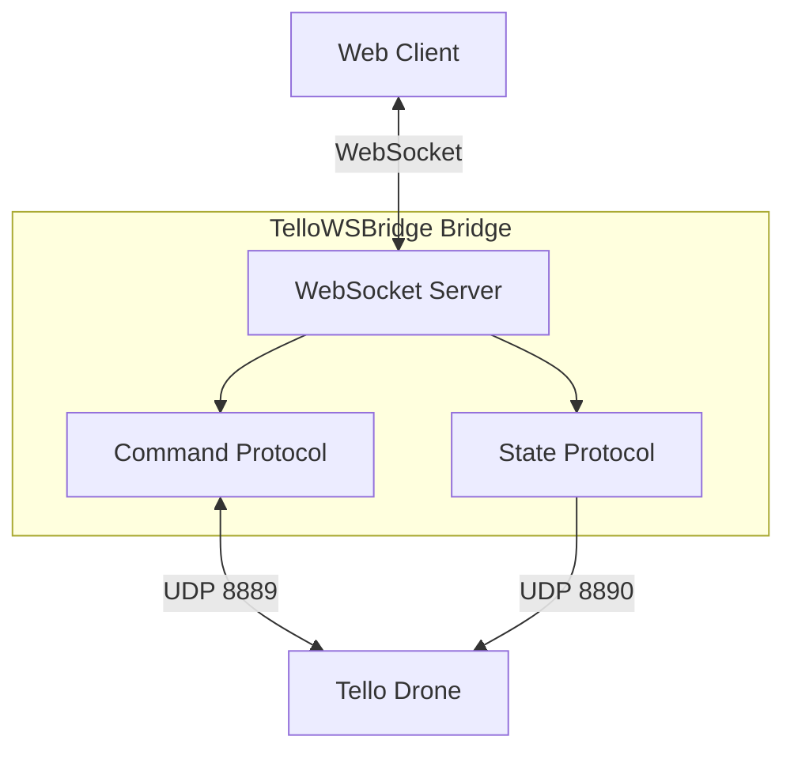
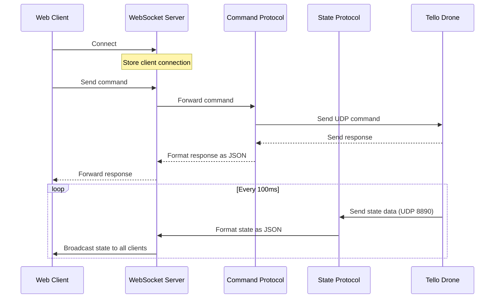
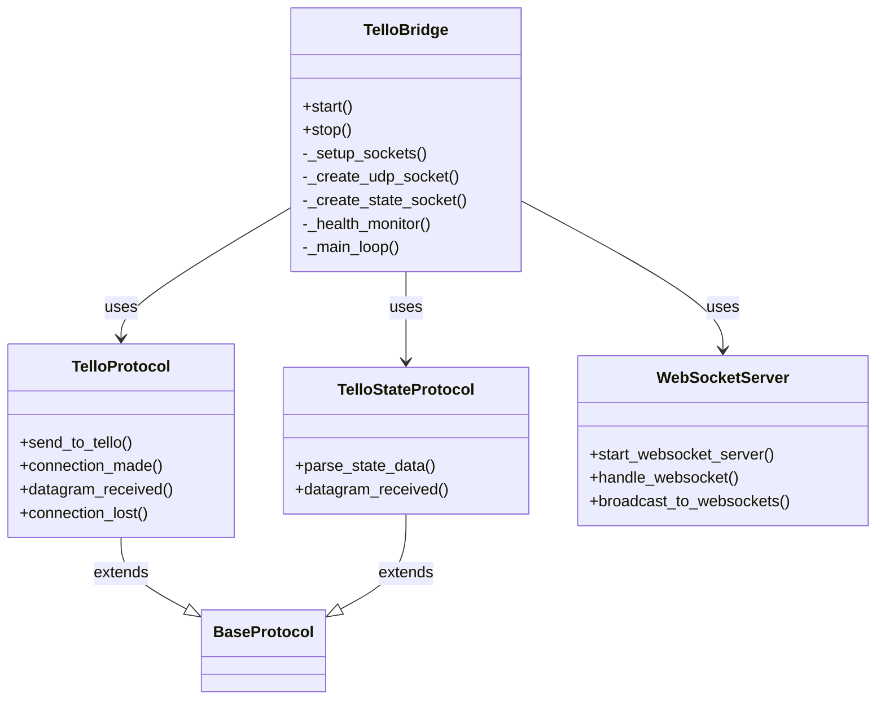

# Tello TelloWSBridge Bridge

A WebSocket bridge for communicating with the DJI Tello drone. This project allows you to control the Tello drone via WebSocket connections, providing a modern interface for web applications and other WebSocket-capable clients.

## Features

- 🚁 Bidirectional communication with the Tello drone
- 🌐 WebSocket server for remote control and telemetry
- 📊 Real-time state data streaming
- 🔄 Command sending and response handling
- 🐳 Containerized with Docker for easy deployment
- 🛠️ Configurable via command-line arguments

## Architecture



## Data Flow



## Installation

### Prerequisites

- Docker and Docker Compose (recommended)
- Python 3.9 or higher (for running without Docker)
- Tello drone (tested with Tello EDU)

### Docker Installation (Recommended)

1. Clone the repository:

   ```bash
   git clone https://github.com/yourusername/TelloWSBridge.git
   cd TelloWSBridge
   ```

2. Configure settings in `docker-compose.yml` if needed:

   ```yaml
   version: "3.8"

   services:
     TelloWSBridge:
       build: .
       restart: unless-stopped
       privileged: true
       network_mode: host
       command:
         - python
         - main.py
         - --socket-host
         - 192.168.10.1 # Tello IP address
         - --socket-port
         - "8889" # Tello command port
         - --local-port
         - "9000" # Local UDP port
         - --websocket-host
         - 0.0.0.0 # WebSocket host (0.0.0.0 for all interfaces)
         - --websocket-port
         - "8005" # WebSocket port
         - --video-port
         - "8555" # Video port
         - --debug # Enable debug logging
   ```

3. Start the service:
   ```bash
   docker-compose up -d
   ```

### Manual Installation

1. Clone the repository:

   ```bash
   git clone https://github.com/yourusername/TelloWSBridge.git
   cd TelloWSBridge
   ```

2. Install dependencies:

   ```bash
   pip install websockets asyncio
   ```

3. Run the bridge:
   ```bash
   python main.py --socket-host 192.168.10.1 --websocket-port 8005 --debug
   ```

## Usage

### Connecting to the Tello Drone

1. Power on your Tello drone
2. Connect to the Tello's Wi-Fi network
3. Start the TelloWSBridge bridge using Docker or manually
4. The bridge will automatically attempt to establish communication with the drone

### Connecting from a Web Client

Connect to the WebSocket server from your web application:

```javascript
// JavaScript example
const ws = new WebSocket("ws://localhost:8005");

// Send commands to the drone
ws.onopen = () => {
  console.log("Connected to Tello bridge");
  // Send the takeoff command
  ws.send("takeoff");
};

// Listen for responses and state updates
ws.onmessage = (event) => {
  const data = JSON.parse(event.data);

  if (data.origin === "command") {
    console.log("Command response:", data.data);
  } else if (data.origin === "state") {
    console.log("Drone state:", data.parsed);
    // Access specific state parameters
    console.log("Battery:", data.fields.bat.value, "%");
    console.log("Height:", data.fields.h.value, "cm");
  }
};
```

### Available Commands

The Tello drone supports various commands that can be sent through the WebSocket:

| Command   | Description                               | Example       |
| --------- | ----------------------------------------- | ------------- |
| command   | Enter SDK mode                            | `command`     |
| takeoff   | Take off                                  | `takeoff`     |
| land      | Land                                      | `land`        |
| up x      | Ascend x cm (20-500)                      | `up 100`      |
| down x    | Descend x cm (20-500)                     | `down 50`     |
| left x    | Fly left x cm (20-500)                    | `left 50`     |
| right x   | Fly right x cm (20-500)                   | `right 50`    |
| forward x | Fly forward x cm (20-500)                 | `forward 100` |
| back x    | Fly backward x cm (20-500)                | `back 50`     |
| cw x      | Rotate x degrees clockwise (1-360)        | `cw 90`       |
| ccw x     | Rotate x degrees counterclockwise (1-360) | `ccw 90`      |
| flip x    | Flip in direction x (l,r,f,b)             | `flip f`      |
| speed x   | Set speed x cm/s (10-100)                 | `speed 50`    |
| battery?  | Get battery percentage                    | `battery?`    |

For a complete list of commands, refer to the [Tello SDK 2.0 documentation](https://dl-cdn.ryzerobotics.com/downloads/Tello/Tello%20SDK%202.0%20User%20Guide.pdf).

## System Components



## Under the Hood

1. **Command Flow**: When a command is received via WebSocket, it's forwarded to the Tello drone via UDP on port 8889. Responses are sent back through the WebSocket.

2. **State Data**: The drone broadcasts state data on UDP port 8890. This data is parsed into a structured format and broadcasted to all connected WebSocket clients.

3. **Health Monitoring**: The bridge constantly monitors the connection to the drone and attempts to reconnect if communication is lost.

4. **WebSocket Management**: The bridge maintains a list of active WebSocket connections and handles multiple clients simultaneously.

## Configuration Options

| Parameter        | Description                            | Default      |
| ---------------- | -------------------------------------- | ------------ |
| --socket-host    | Tello IP address                       | 192.168.10.1 |
| --socket-port    | Tello UDP command port                 | 8889         |
| --local-port     | Local UDP port for receiving responses | 9000         |
| --websocket-host | WebSocket server host address          | 0.0.0.0      |
| --websocket-port | WebSocket server port                  | 8765         |
| --video-port     | Video HTTP server port                 | 8555         |
| --debug          | Enable debug logging                   | False        |

## Troubleshooting

### Connection Issues

If the bridge fails to connect to the Tello drone:

1. Ensure you're connected to the Tello's Wi-Fi network
2. Verify the drone is powered on and the battery is charged
3. Check that the correct IP address is specified (usually 192.168.10.1)
4. Try restarting the drone and the bridge

### WebSocket Connection Issues

If clients can't connect to the WebSocket server:

1. Verify the WebSocket service is running (`docker-compose ps`)
2. Check that you're using the correct WebSocket URL (`ws://host:port`)
3. Ensure no firewall is blocking the WebSocket port

## Contributing

Contributions are welcome! Please feel free to submit a Pull Request.

## License

This project is licensed under the MIT License - see the LICENSE file for details.

## Acknowledgements

- [DJI Tello](https://www.ryzerobotics.com/tello)
- [Tello SDK 2.0](https://dl-cdn.ryzerobotics.com/downloads/Tello/Tello%20SDK%202.0%20User%20Guide.pdf)
